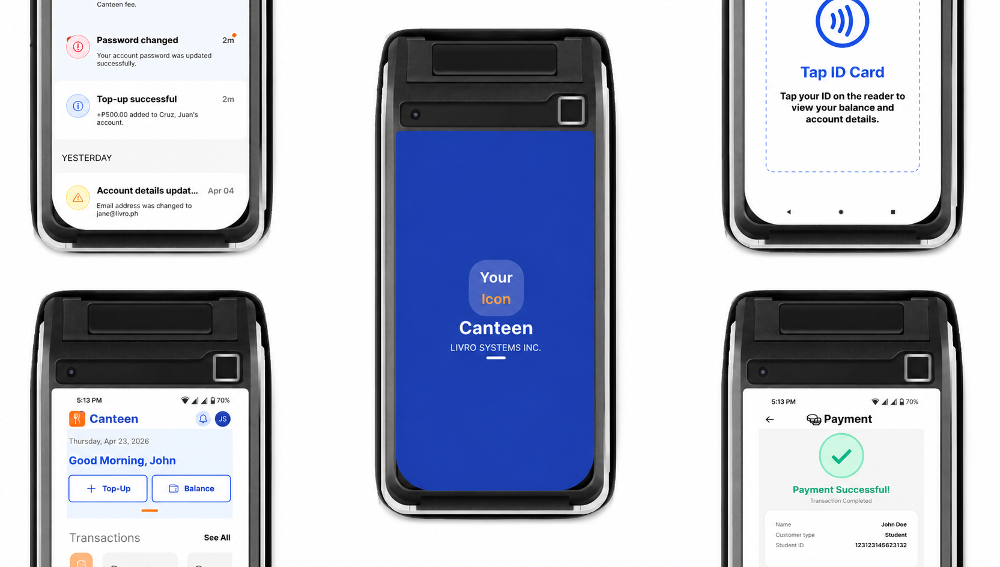

# 🧪 Projects

## **DIGINOTE**🔗

Developer | Freelance

    
  
  
- a note-taking app that seamlessly integrates question submission and viewing capabilities.

  
<strong>TECH STACK USED:</strong>

  <ul>
    <li>Flutter</li>
    <li>Dart</li>
    <li>Firebase</li>
    <li>Django REST API</li>
  </ul>

## **PICK-IT**🔗

Developer | Freelance

  
  
  
  

- an interactive Web-based Game in which users can learn and classify rocks and minerals based on their varied characteristics.

<strong>TECH STACK USED:</strong>

<ul>
  <li>Phaser 3</li>
  <li>Typescript</li>
  <li>Vite.js</li>
  <li>Supabase</li>
</ul>

## **EVA**🔗

Developer | Freelance

  
  
- a Web-Based Employee evaluation platform designed to enhance the employee evaluation process within organizations.

<strong>TECH STACK USED:</strong>

<ul>
  <li>Django Web Framework</li>
  <li>Python</li>
</ul>

## **SUPER ADMIN APP** 🔗

Developer | Contract at <a href="https://livro.systems/">Livro Systems Inc.</a>

  
  

- Super Admin App provides administrators direct access to important school statistics for faster and more convenient community management.

<strong>TECH STACK USED:</strong>

<ul>
  <li>Flutter</li>
  <li>Dart</li>
  <li>Frappe</li>
  <li>Python</li>
  <li>Firebase</li>
</ul>

## **WELA PARENT APP**🔗

Developer | Contract at <a href="https://livro.systems/">Livro Systems Inc.</a>

  
  
  

- A parent monitoring app that tracks students' performance and information.

<ul>
  <li>Flutter</li>
  <li>Dart</li>
  <li>Frappe</li>
  <li>Python</li>
  <li>Firebase</li>
  <li>Fastlane</li>
</ul>

## **SMART CANTEEN**🔗

Developer | Contract at <a href="https://livro.systems/">Livro Systems Inc.</a>

  
  
- A cashless canteen payment system that lets students pay for meals and supplies with a tap of their school ID — fast, secure, and fully tracked at every transaction.

  
Smart Canteen runs on a POS terminal at the canteen counter, letting cashiers process student payments for meals and supplies through a simple tap of their school ID or RFID card. Every transaction is logged automatically, parents can monitor spending in real time, and daily limits keep student allowances in check. It reduces cash handling, shortens queue times, and keeps canteen operations clean and accountable.

<strong>TECH STACK USED:</strong>

<ul>
  <li>RFID</li>
  <li>Flutter</li>
  <li>Python</li>
</ul>